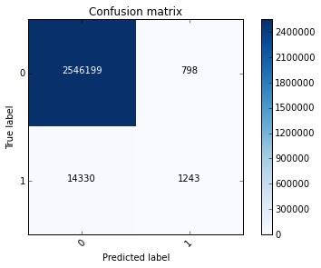
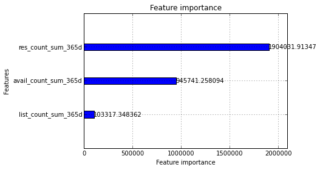

*NOTE: In the TL,DR, optimize for **clarity** and **comprehensiveness**. The goal is to convey the post with the least amount of friction, especially since ipython/beakers require much more scrolling than blog posts. Make the reader get a correct understanding of the post's takeaway, and the points supporting that takeaway without having to strain through paragraphs and tons of prose. Bullet points are great here, but are up to you. Try to avoid academic paper style abstracts.*

 - Having a specific title will help avoid having someone browse posts and only finding vague, similar sounding titles
 - Having an itemized, short, and clear tl,dr will help readers understand your content
 - Setting the reader's context with a motivation section makes someone understand how to judge your choices
 - Visualizations that can stand alone, via legends, labels, and captions are more understandable and powerful


### Motivation

*NOTE: optimize in this section for **context setting**, as specifically as you can. For instance, this post is generally a set of standards for work in the repo. The specific motivation is to have least friction to current workflow while being able to painlessly aggregate it later.*

The knowledge repo was created to consolidate research work that is currently scattered in emails, blogposts, and presentations, so that people didn't redo their work.


```python
import lightgbm as lgb
import pandas as pd
import numpy as np
from sklearn.model_selection import train_test_split
from sklearn import metrics

import matplotlib
%matplotlib inline
import matplotlib.pyplot as plt

try:
    import cPickle as pickle
except:
    import pickle
```

```python
import itertools

def plot_confusion_matrix(cm, classes,
                          normalize=False,
                          title='Confusion matrix',
                          cmap=plt.cm.Blues):
    """
    This function prints and plots the confusion matrix.
    Normalization can be applied by setting `normalize=True`.
    """
    plt.imshow(cm, interpolation='nearest', cmap=cmap)
    plt.title(title)
    plt.colorbar()
    tick_marks = np.arange(len(classes))
    plt.xticks(tick_marks, classes, rotation=45)
    plt.yticks(tick_marks, classes)

    if normalize:
        cm = cm.astype('float') / cm.sum(axis=1)[:, np.newaxis]
        print("Normalized confusion matrix")
    else:
        print('Confusion matrix, without normalization')

    print(cm)

    thresh = cm.max() / 2.
    for i, j in itertools.product(range(cm.shape[0]), range(cm.shape[1])):
        plt.text(j, i, cm[i, j],
                 horizontalalignment="center",
                 color="white" if cm[i, j] > thresh else "black")

    plt.tight_layout()
    plt.ylabel('True label')
    plt.xlabel('Predicted label')
```
# feat0 model


```python
df_test = pd.read_csv('/Users/fezhao/Projects/traffic_manager/data/test_feat1.csv', sep='|')

df_test.drop(['hotelid', 'request_log_date'], axis=1, inplace=True)

y_test = df_test['label']

X_test = df_test.drop(['label'], axis=1)
```

```python
with open('/Users/fezhao/Projects/traffic_manager/data/model_feat0.pkl', 'rb') as fin:
    gbm = pickle.load(fin)
    
y_pred = gbm.predict(X_test, num_iteration=gbm.best_iteration)
```

```python
preds = y_pred >= 0.5
labels = y_test
cm = metrics.confusion_matrix(labels, preds)
```

```python
plot_confusion_matrix(cm, classes=[0,1])
```
    Confusion matrix, without normalization
    [[2546199     798]
     [  14330    1243]]





```python
print metrics.classification_report(labels, preds)
```
                 precision    recall  f1-score   support
    
              0       0.99      1.00      1.00   2546997
              1       0.61      0.08      0.14     15573
    
    avg / total       0.99      0.99      0.99   2562570
    


```python
ax = lgb.plot_importance(gbm, max_num_features=20, importance_type='gain')
plt.show()
```





```python

```
