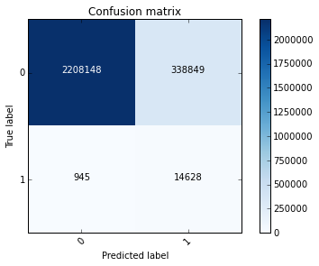

Given a partner and a hotel, use the model to predict whether there will be reservation call for the next day. The main takeaways are as follows:

 - The model metrics improves w.r.t. more features
 - The final model only blocks 4% of the reservations but block 87% of the zero reservations

### Motivation

Given the cost of the API calls, we would like to investigate the possibility of using machine learning to predict the efficiency of the API calls. As such, we could block the list API calls are unlikely to generate reservation, in order to saving the cost of API calls.

### Data

Due to the large scale of the API dataset, here we did an data undersampling for fast model iterations and better data understanding.

- We pick one partner DESPEGAR.COM
- For DESPEGAR.COM, we randomly sample 1/10 of the hotels, the number of active hotels is 28,473
- Each instance is the daily features for each hotel, we fill all zero for API calls for missing dates
- Historical data: from 2015-01-01 to 2017-03-31
- Train instance data: from 2016-01-01 to 2016-12-31, them we undersample the training data to make the dataset balance regarding to the label
- Test instance data: from 2017-01-01 to 2017-03-31


```python
import lightgbm as lgb
import pandas as pd
import numpy as np
from sklearn.model_selection import train_test_split
from sklearn import metrics

import matplotlib
%matplotlib inline
import matplotlib.pyplot as plt

try:
    import cPickle as pickle
except:
    import pickle
    
from __future__ import print_function
```

```python
import itertools

def plot_confusion_matrix(cm, classes,
                          normalize=False,
                          title='Confusion matrix',
                          cmap=plt.cm.Blues):
    """
    This function prints and plots the confusion matrix.
    Normalization can be applied by setting `normalize=True`.
    """
    plt.imshow(cm, interpolation='nearest', cmap=cmap)
    plt.title(title)
    plt.colorbar()
    tick_marks = np.arange(len(classes))
    plt.xticks(tick_marks, classes, rotation=45)
    plt.yticks(tick_marks, classes)

    if normalize:
        cm = cm.astype('float') / cm.sum(axis=1)[:, np.newaxis]

    thresh = cm.max() / 2.
    for i, j in itertools.product(range(cm.shape[0]), range(cm.shape[1])):
        plt.text(j, i, cm[i, j],
                 horizontalalignment="center",
                 color="white" if cm[i, j] > thresh else "black")

    plt.tight_layout()
    plt.ylabel('True label')
    plt.xlabel('Predicted label')
```

```python
def get_preds(model_path, X_test):
    with open(model_path, 'rb') as fin:
        gbm = pickle.load(fin)

    y_preds = gbm.predict(X_test, num_iteration=gbm.best_iteration)
    return y_preds
```
## feat0 model

3 Features:

 - list_count_sum_365d
 - avail_count_sum_365d
 - res_count_sum_365d


```python
df_test = pd.read_csv('/Users/fezhao/Projects/traffic_manager/data/test_feat1.csv', sep='|')
df_test.drop(['hotelid', 'request_log_date'], axis=1, inplace=True)

y_test = df_test['label']
X_test = df_test[['list_count_sum_365d', 'avail_count_sum_365d', 'res_count_sum_365d']]

y_pred_feat0 = get_preds('/Users/fezhao/Projects/traffic_manager/data/model_feat0.pkl', X_test)
np.savetxt('/Users/fezhao/Projects/traffic_manager/data/y_pred_feat0.txt', y_pred_feat0, '%.8f')
```
## feat1 model

12 Features:

 - list_count_sum_[365d, 30d, 7d, prev]
 - avail_count_sum_[365d, 30d, 7d, prev]
 - res_count_sum_[365d, 30d, 7d, prev]


```python
df_test = pd.read_csv('/Users/fezhao/Projects/traffic_manager/data/test_feat1.csv', sep='|')
df_test.drop(['hotelid', 'request_log_date'], axis=1, inplace=True)

y_test = df_test['label']
X_test = df_test.drop(['label'], axis=1)

y_pred_feat1 = get_preds('/Users/fezhao/Projects/traffic_manager/data/model_feat1.pkl', X_test)
np.savetxt('/Users/fezhao/Projects/traffic_manager/data/y_pred_feat1.txt', y_pred_feat1, '%.8f')
```
## feat2 model

40 Features:

 - list_count_sum_[365d, 30d, 7d, prev]
 - avail_count_sum_[365d, 30d, 7d, prev]
 - res_count_sum_[365d, 30d, 7d, prev]
 - hotelpedia features


```python
df_test = pd.read_csv('/Users/fezhao/Projects/traffic_manager/data/test_feat2.csv', sep='|')
df_test.drop(['hotelid', 'request_log_date', 'tnow_id'], axis=1, inplace=True)

y_test = df_test['label']
X_test = df_test.drop(['label'], axis=1)

y_pred_feat2 = get_preds('/Users/fezhao/Projects/traffic_manager/data/model_feat2.pkl', X_test)
np.savetxt('/Users/fezhao/Projects/traffic_manager/data/y_pred_feat2.txt', y_pred_feat2, '%.8f')
```
## feat3 model

60 Features:

 - list_count_sum_[365d, 30d, 7d, prev]
 - avail_count_sum_[365d, 30d, 7d, prev]
 - res_count_sum_[365d, 30d, 7d, prev]
 - hotelpedia features
 - derived features from date: day_of_week, month
 - derived ratio features:
    * avail_list_ratio, res_avail_ratio, res_list_ratio
    * prev_7d_ratio, 7d_30d_ratio, 30d_365d_ratio


```python
df_test = pd.read_csv('/Users/fezhao/Projects/traffic_manager/data/test_feat3.csv', sep='|')
df_test.drop(['hotelid', 'request_log_date', 'tnow_id'], axis=1, inplace=True)

y_test = df_test['label']
X_test = df_test.drop(['label'], axis=1)

y_pred_feat3 = get_preds('/Users/fezhao/Projects/traffic_manager/data/model_feat3.pkl', X_test)
np.savetxt('/Users/fezhao/Projects/traffic_manager/data/y_pred_feat3.txt', y_pred_feat3, '%.8f')
```
## Analysis results


```python
y_pred_feat0 = np.loadtxt('/Users/fezhao/Projects/traffic_manager/data/y_pred_feat0.txt')
y_pred_feat1 = np.loadtxt('/Users/fezhao/Projects/traffic_manager/data/y_pred_feat1.txt')
y_pred_feat2 = np.loadtxt('/Users/fezhao/Projects/traffic_manager/data/y_pred_feat2.txt')
y_pred_feat3 = np.loadtxt('/Users/fezhao/Projects/traffic_manager/data/y_pred_feat3.txt')
```

```python
def show_metrics(y_pred, y_test):
    preds = y_pred >= 0.5
    labels = y_test
    cm = metrics.confusion_matrix(labels, preds)
    print('model log loss:' + str(metrics.log_loss(y_test, y_pred)))
    plot_confusion_matrix(cm, classes=[0,1])
```

```python
show_metrics(y_pred_feat0, y_test)
```
    model log loss:0.301645615138


```python
show_metrics(y_pred_feat1, y_test)
```
    model log loss:0.299786225885


```python
show_metrics(y_pred_feat2, y_test)
```
    model log loss:0.294032894584





```python
show_metrics(y_pred_feat3, y_test)
```
    model log loss:0.290106144481


```python

```
